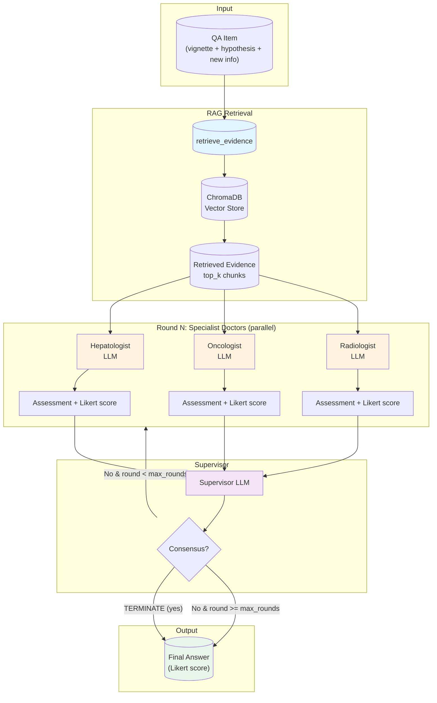

# A3 and A4 Architecture Diagram

A3 and A4 share the same multi-agent consensus RAG architecture. The only difference is the model class:
- **A3** uses large models (e.g., gpt52)
- **A4** uses small models (e.g., qwen3_vl_30b)

## Component Details

| Component | Description |
|-----------|-------------|
| **retrieve_evidence** | Queries ChromaDB with the case text, returns top_k relevant chunks. Builds case presentation with evidence for doctors. |
| **Hepatologist** | Specialized in liver diseases, cirrhosis, viral hepatitis, transplant evaluation. Analyzes from hepatology perspective. |
| **Oncologist** | Specialized in HCC staging, systemic therapies, BCLC, tumor markers. Analyzes from oncology perspective. |
| **Radiologist** | Specialized in liver imaging (LI-RADS), CT/MRI. Analyzes imaging findings. |
| **Supervisor** | Evaluates specialists' assessments, determines if consensus reached. If not, guides further discussion (next round). Outputs TERMINATE + final score when consensus is reached. |

## Data Flow

1. **Retrieval**: Case text is used to retrieve relevant evidence from ChromaDB (embeddings + similarity search).
2. **Case presentation**: Evidence is injected into a structured prompt with case + task (SCT format with Likert scale instructions).
3. **Doctors round**: All three specialists run in parallel (ThreadPoolExecutor, 3 workers). Each receives the same case + evidence, outputs analysis and Likert score.
4. **Supervisor**: Reviews all assessments. If consensus (TERMINATE in response), outputs final score. Otherwise, appends discussion to conversation history and loops to doctors (max_rounds = 13).
5. **Final answer**: Extracted from supervisor's consensus score or last round.

## Model Routing

| Arm | Role | Default Model |
|-----|------|---------------|
| A3 | consensus_large | gpt52 |
| A4 | consensus_small | qwen3_vl_30b |

All four agents (Hepatologist, Oncologist, Radiologist, Supervisor) use the same model within a run. LLM params (temperature, max_tokens, etc.) are applied consistently via `resolve_llm_params()`.
